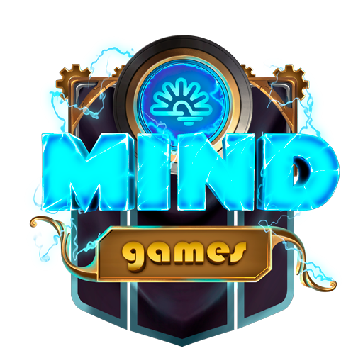

# MIND Games


"A mind can change everything, on any scale, to any aspect of life or history. Our MINDS are meant to do just that."

&#x20;                                                                                                                       “A random MIND”


## What is MIND Games

MIND Games is a game universe that offers players a unique and immersive experience. In this world, players are part of a top-secret research team tasked with exploring a new planet on the other side of a black hole, inhabited by MINDS. The goal is to collect NFTs, participate in missions, and engage in battles with other players to build a thriving community within the MIND Games Metaverse.


**Good to know:** MIND Games implemented [**DeFi instruments**](broken-reference) in all of the game modes. All NFTs will be available to use throughout the MIND Universe.&#x20;


## Behind The MIND

The NFTs in MIND Games have unique characteristics that make them rare and valuable, such as differing statistics and abilities. Players are represented by Researcher cards that can be customized based on their playing style and interests, and all Talent points acquired can be traded on the Marketplace.

To ensure a safe and sustainable player experience, MIND Games has a limited daily energy system, and rewards players for their efforts with resources, items, and other bonuses. The Decentralized Exchange platform within the Marketplace allows players to swap tokens and participate in the Piero’s Statue offering. Additionally, the Research Facility offers staking opportunities for players to deposit tokens and receive rewards for their contributions to the scientific community.

Overall, MIND Games offers a dynamic and engaging experience for players looking to immerse themselves in a unique and thriving game universe.


**Got Problems? Tell us all about it:** <mark style="color:blue;"></mark> [<mark style="color:blue;">**Contact**</mark>](https://forms.office.com/r/y33GyxmUnd)<mark style="color:blue;">****</mark>


