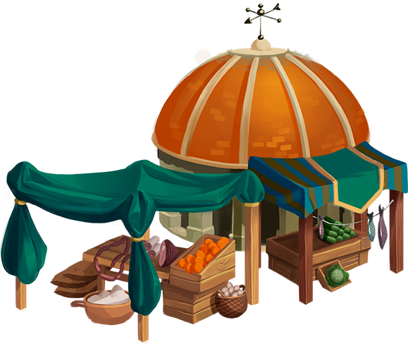

# 🛍 Marketplace

### Overview:&#x20;

* Swap Tokens&#x20;
* Create Liquidity Pool Tokens - <mark style="color:yellow;">**STX-LP**</mark>
* Trade items&#x20;

Our users will be able to swap tokens on our [**Decentralized Exchange**](decentralized-exchange.md) platform. In-game, in [**Neuropia**](../learn/game-basics/neuropia/) **** - where our journey begins, this will be called the Marketplace. Apart from swapping tokens, players can exchange in-game resources. The Marketplace will also allow players to pair two tokens, for example, [<mark style="color:yellow;">**STX**</mark>](cortex-token.md) <mark style="color:yellow;">****</mark> and <mark style="color:yellow;">**ETH**</mark>, to join that Liquidity Pool and earn fees any time anyone trades those tokens.

