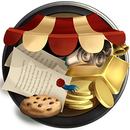

# 🛍 Marketplace

### Overview:&#x20;

* Swap Tokens
* Create Liquidity Pool Tokens - <mark style="color:yellow;">**CRX-LP**</mark>

Our users will be able to swap tokens on our [**Decentralized Exchange**](tavern.md) platform. In-game, in [**Neuropia**](../learn/game-basics/neuropia/) **** - where our journey begins, this will be called the **Marketplace**. Apart from swapping tokens, players can exchange in-game resources. The Marketplace will also allow players to pair two tokens, for example, <mark style="color:yellow;">**\[CRX]**</mark> and <mark style="color:yellow;">**ETH**</mark>, to join that Liquidity Pool.

### Decentralized Exchange:

At the heart of our whole economic process stands the **DEX**. DeFi instruments synergize with games and this results in two main benefits:

1. Simplified UX (User Experience). Implementing the DEX directly into gameplay brings an entertaining alternative to blockchain technology adoption.
2. Sustainability. These instruments operate with the in-game currencies ensuring long-term utility and growth avenues.

* **Swapping** will allow the trading of various tokens and in-game assets for other tokens.&#x20;
* **Staking** will give users permission over voting systems within the MIND Universe.
* **Liquidity Providing** will be there as long-term standing for the players.


0.3% of each trade will be redirected to **Treasury**


A **DEX** component improves and brings value to the game economy. The markets currently hold DEXs that are gamified or gamified DeFi instruments; however, there is not a game that fully incorporates DeFi.\
\
With this project, we propose delivering the MIND Games economy segment via Blockchain and DeFi instruments that help it give our users sovereignty over their in-game assets.
