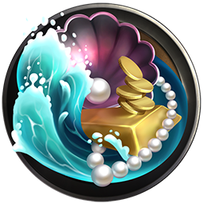

# 🪨 Piero's Statue

### Overview:&#x20;

* A form of yield farming

Commemorating the last MIND who knew the secrets of creating more [<mark style="color:yellow;">**CRX**</mark>](brain-cell-token.md), Piero’s statue is a beloved reminder of MIND History. Another reason everybody is fond of it is its uncommon ability to bring back more [<mark style="color:yellow;">**CRX**</mark>](brain-cell-token.md) <mark style="color:yellow;">****</mark> for token offerings left with it. In itself, Piero’s statue is a form of staking LP tokens and receiving [<mark style="color:yellow;">**CRX**</mark> ](brain-cell-token.md)tokens. Most people think that this is just a statue of the famous alchemist Piero Da Vinci, the last crafter of [<mark style="color:yellow;">**Cortex**</mark>](brain-cell-token.md). This, however, is not the whole truth. Piero, gathering some raw material from Monroe Maw, managed to trap himself in stone. Alas, the stone was not dead but forever imbued with the spirit of Piero himself. &#x20;


Piero now provides an avenue for liquidity providers to receive [<mark style="color:yellow;">**CRX**</mark>](brain-cell-token.md) <mark style="color:yellow;">****</mark> tokens. You will receive [<mark style="color:yellow;">**CRX**</mark>](brain-cell-token.md) to use in the MIND Games for certain important items, skills, and talents!&#x20;


In MIND Games, our very own Piero is our portrayal of yield farming. He receives individual **”Offerings”** which can profit from grants by anyone who joins forces with him. Each **“Offering”** (LP Pair) will give you details on the total share you receive from this grant. Piero studies each offering intensely and you can see this as a timer on each pair. Once he finishes his study, he awards you with your part of the yield representing your share of [<mark style="color:yellow;">**CRX**</mark>](brain-cell-token.md) <mark style="color:yellow;">****</mark> tokens.&#x20;

Sensors and Melders will be able to help ”PIERO” and earn [<mark style="color:yellow;">**CRX**</mark>](brain-cell-token.md) <mark style="color:yellow;">****</mark> based in part on your total stake in a certain **“Offering”**.

## **Issuance Schedule**&#x20;

TBD


Visit [**Arbitrum Block Explorer**](https://aurorascan.dev/)to see the current block and block speed. We recommend viewing the block speed on an average daily/weekly when trying to plan your strategy.


### Locking

TBD


Claiming TBD


**Piero Statue** will inform users regarding the amount of [<mark style="color:yellow;">**CRX**</mark>](brain-cell-token.md) <mark style="color:yellow;">****</mark> received in **** total, how much is available for unlocking at that moment, and how much is locked at that time. \
\
Users can choose to unlock the total [<mark style="color:yellow;">**CRX**</mark>](brain-cell-token.md) <mark style="color:yellow;">****</mark> received at a particular time, before the 51st Epoch, however, they will only obtain the unlocked portion of it. The rest will be locked in the deep magma layers of Monro Maw, from where you will start to acquire them via the vesting schedule. \
\
This model helps us migrate from the simple DEX economics to the in-game economics combining the DeFi tools with gameplay and creating a synergy that will nourish them both. If the tokens were to unlock at any given time, this would incentivize the farm and dump mechanics. This way, we ensure that the long-term sustainability of the token will always be relevant to the ecosystem that we are taking part in.

### Locking Model - Early Unlocking with Researchers and MIND NFTs

We are implementing the ability for **Researchers** and **MINDS** to work together and unlock [<mark style="color:yellow;">**CRX**</mark>](brain-cell-token.md) <mark style="color:yellow;">****</mark> tokens early with [**Cryptography Missions**](../learn/game-basics/neuropia/missions.md#cryptography)**.** \
The researcher's Talents and MINDS stats will determine the amount of [<mark style="color:yellow;">**CRX**</mark>](brain-cell-token.md) <mark style="color:yellow;">****</mark> unlocked after each quest.

### **Piero’s Statue Staking Deposit and Withdrawal Fees**

TBD


All the fees collected from withdrawals on each pool will be distributed to the **** [**Treasury**](brain-cell-token.md).

