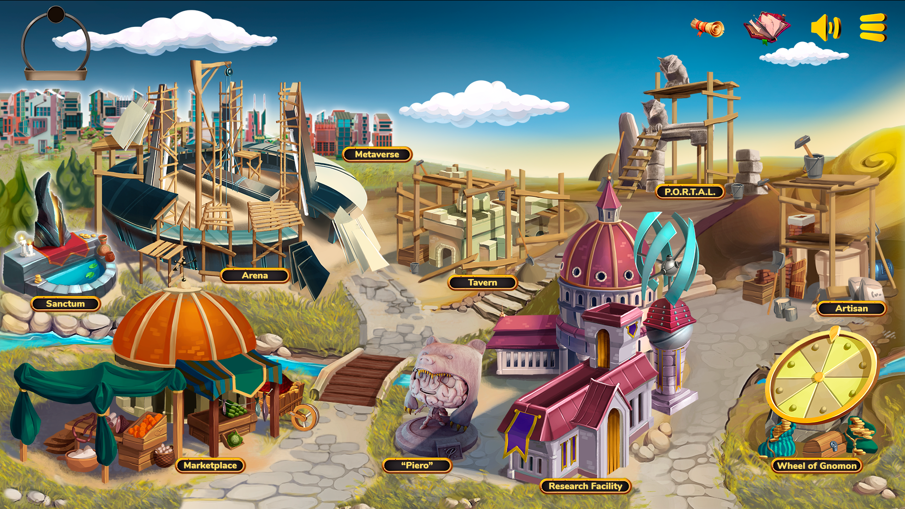

# Phase 1 - DeFi Instruments

****[**Neuropia**](../../learn/game-basics/neuropia/)**,** an old MIND settlement filled with history and culture is slowly becoming a buzzing center for MINDS everywhere. They begin developing new buildings and exploring new ventures.

The city center of Neuropia is the beginning of our players’ journey. The Marketplace, Piero’s Statue, and the Research Facility, some of the oldest and most renowned landmarks in the area are open to the public and functional to modern standards. The MINDS are working hard to develop the other buildings currently under construction.\
\
Research Log. Entry 813:&#x20;

The most eminent Researchers have been studying for a long time the newly discovered planet of MINDS. Today we are ready to launch. Thank you, brave researchers! All systems are ready! T minus 5, 4, 3, 2, 1…

* [Decentralized Exchange](../decentralized-exchange.md) - UniswapV2 Protocol :white\_check\_mark:
* [<mark style="color:yellow;">**Cortex \[CRX\]**</mark>](../brain-cell-token.md) <mark style="color:yellow;">****</mark> token launch :white\_check\_mark:
* Invest [<mark style="color:yellow;">**\[CRX\]**</mark>](../brain-cell-token.md) tokens in the [Research Facility](../research-facility.md) :white\_check\_mark:
* Stake LP Tokens with [Piero's Statue](../pieros-statue.md) to earn [<mark style="color:yellow;">**\[CRX\]**</mark>](../brain-cell-token.md) tokens :white\_check\_mark:
* [<mark style="color:yellow;">**\[CRX\]**</mark>](../brain-cell-token.md) Airdrop for the first 1000 people to join and verify in our [Discord Server](https://discord.gg/mindgames). :white\_check\_mark:
