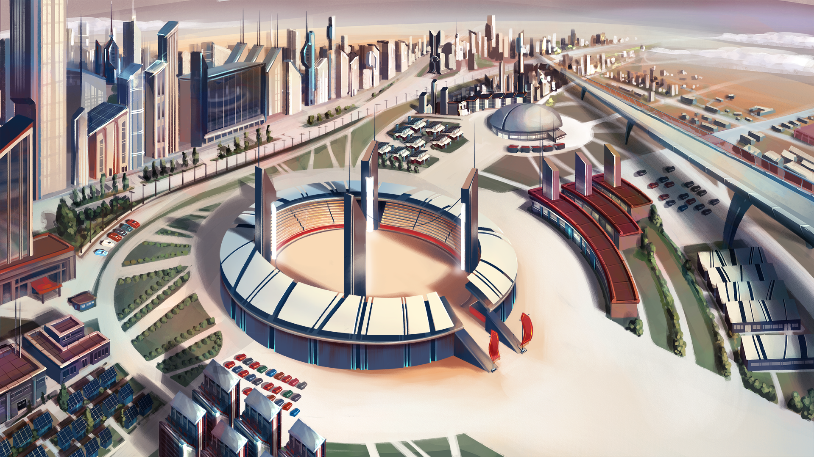

# ARENA

**Findings log. Entry 339:**

The MINDS, seem to resolve their conflicts in a non-physical way. They carry out what looks to be mental battles in a building that resembles a Colosseum here on Earth. The fighting happens in teams of 5 MINDS; however, there are only 2 MINDS of each team in the Arena at once. \
\
Our researchers are still looking at how the rules work and why certain teams seem to form stronger bonds and defeat more opponents. There is one match currently in progress, and OUCH! That's gotta hurt.


**Good to know:** The Arena is a multiplayer game of 3v3 or 5v5 MIND NFTs. The rewards are based on the type of battle entered: For example, players can only receive a rank and climb the ladder by playing 5v5. The NFTs have various stats that determine the amount and frequency of damage they can deal to an enemy and their resistance to being attacked.


All cards have an overall IQ stat, and once that reaches 0, that card has lost the match. The players will have an Attacker and a Defender position on the board and keep the other cards on the side. After every round, the players can choose to swap the cards in play. Each card has a series of 3 abilities that can be used for either defense, offense, or passive boosts. The winner of the Arena is the last one with an NFT still standing!

* **Ranked Mode** - 5 MINDS are needed to play Ranked Arena games. Earn Rank, Experience, and Rewards.
* **Challenger Mode** - At least 3 MINDS are needed to play Arena Challenge matches. Earn 90% of the entry fee cumulated from both players.

Are your MINDS strong enough? Is your strategy better? Should we stop questioning the obvious?


90% of the entry fee cumulated from both players will go to the winner \
10% of the entry fee cumulated from both players will be redistributed to the Research Facility and Vault.

