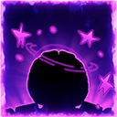
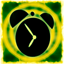
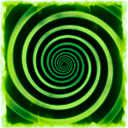

# Spells

All cards have 3 spells: **1 Attack**, **1 Defence** and **1 Passive**. The position on which you place the card will determine which spell is played by that card: attack or defense. The passive is applied to both cards on your side of the board. The 2 cards played on the board are called the Nucleus. The rest of the cards kept in hand + the Nucleus are called the Circuit.


The final value of spell damage is determined by integrating the card's Rarity formula.



When one player has only **ONE MIND** left standing on the board, it will **ENRAGE**. Enrage will give that MIND an **Extra Attack** using its **MAIN STAT** to both enemy positions besides its normal spells. In return, it will receive **DOUBLE DAMAGE** to its IQ!



<mark style="color:red;">**ASSAULT:**</mark> Spells with this perk will happen at the beginning of the turn.

<mark style="color:yellow;">**AEGIS:**</mark> These spells happen after ASSAULT spells.

<mark style="color:green;">**AURA:**</mark> These spells are triggered spells. They trigger based on a condition.&#x20;

<mark style="color:blue;">**OVERLOAD:**</mark> These spells happen at the end of the turn.



Spell effects are constantly being balanced and edited in order to have competitive gameplay. Always read the tooltip in game!





<table><thead><tr><th width="118">Icon</th><th width="164">Spell Name</th><th width="367.91846921797">Spell Effect</th></tr></thead><tbody><tr><td></td><td>Brickwall</td><td><mark style="color:yellow;"><strong>[AEGIS]</strong></mark> Block <strong>Frontal</strong> * 0.75 for the first attack.</td></tr><tr><td></td><td>Remember</td><td><mark style="color:yellow;"><strong>[AEGIS]</strong></mark> Take all damage dealt from the <strong>circuit</strong> this turn and restore half as IQ.</td></tr><tr><td></td><td>Ram</td><td><mark style="color:yellow;"><strong>[AEGIS]</strong></mark> Protect your entire <strong>circuit</strong>. Return half of the damage recived to the attacker.</td></tr><tr><td></td><td>Mind Wipe</td><td><mark style="color:yellow;"><strong>[AEGIS]</strong></mark> If your attacker is attacked, deflect 75% of the damage.</td></tr><tr><td></td><td>Deja Vu</td><td>Deal <strong>Motor</strong> * 0.75. Enemy attacker forgets <strong>Motor</strong> worth of their next attack this turn.</td></tr><tr><td></td><td>Motivate</td><td><mark style="color:yellow;"><strong>[AEGIS]</strong></mark> Connect all Nodes in this arena. For each Node, defend 5.</td></tr><tr><td></td><td>Memory</td><td><mark style="color:yellow;"><strong>[AEGIS]</strong></mark> If attacked, cancel the enemy's next turn's passives.</td></tr><tr><td></td><td>Solve</td><td><mark style="color:yellow;"><strong>[AEGIS]</strong></mark> If attacked, restore a fourth of the damage as IQ and hide the attacker.</td></tr><tr><td></td><td>Counter</td><td><mark style="color:yellow;"><strong>[AEGIS]</strong></mark> 50% chance for the enemy to attack a different character.</td></tr><tr><td></td><td>Ring a bell</td><td><mark style="color:yellow;"><strong>[AEGIS]</strong></mark> Block F/2 and restore a third of the attack as IQ.</td></tr><tr><td></td><td>Brainstorm</td><td><mark style="color:yellow;"><strong>[AEGIS]</strong></mark> If attacked, distribute damage to this card over 3 turns.</td></tr><tr><td></td><td>Dizzy</td><td><mark style="color:yellow;"><strong>[AEGIS]</strong></mark> Distribute damage taken to your circuit.</td></tr><tr><td></td><td>Subliminal</td><td><mark style="color:yellow;"><strong>[AEGIS]</strong></mark> Block <strong>Temporal</strong> worth of damage for your <strong>nucleus</strong> for 2 turns.</td></tr><tr><td></td><td>Faint</td><td><mark style="color:yellow;"><strong>[AEGIS]</strong></mark> Restore half of the damage received as IQ.</td></tr><tr><td></td><td>Out Of Sight</td><td><mark style="color:yellow;"><strong>[AEGIS]</strong></mark> Restore your IQ with 10 multiplied by the number cards that died while this was on the <strong>nucleus.</strong></td></tr><tr><td></td><td>Tabula Rasa</td><td><mark style="color:blue;"><strong>[OVERLOAD]</strong></mark> At the end of the turn, restore your circuits IQ with <strong>Frontal</strong> * 1.5.</td></tr><tr><td></td><td>Head for the Hills</td><td><mark style="color:yellow;"><strong>[AEGIS]</strong></mark> If your attacker is attacked, restore your circuit with <strong>Temporal</strong> worth of IQ for 2 turns and hide.</td></tr><tr><td></td><td>Think Alike</td><td><mark style="color:yellow;"><strong>[AEGIS]</strong></mark> Block <strong>Frontal</strong> worth of damage.</td></tr></tbody></table>




<table><thead><tr><th width="119.51695487834706">Icon</th><th width="150">Spell Name</th><th>Spell Effect</th></tr></thead><tbody><tr><td></td><td>Attention Seeker </td><td><mark style="color:blue;"><strong>[OVERLOAD]</strong></mark>  Attack last, deal double damage taken this turn split to the enemy <strong>circuit.</strong></td></tr><tr><td></td><td>Doubt</td><td>Attack a random enemy card <strong>Frontal</strong> * 1.5 . At the end of the turn, hide this card.</td></tr><tr><td></td><td>Pulverize</td><td><mark style="color:yellow;"><strong>[AEGIS]</strong></mark> Take all damage dealt this turn. Deal equal damage to the enemy defender.</td></tr><tr><td></td><td>Nullify</td><td>Deal <strong>Motor</strong> * 3 to the enemy defender.</td></tr><tr><td></td><td>Head Count</td><td>Deal <strong>Motor</strong>+(<strong>Frontal</strong>*2) to the <strong>enemy</strong> <strong>nucleus</strong> for 2 turns.</td></tr><tr><td></td><td>Boggle</td><td>Deal <strong>Motor</strong> * 1.5 to the enemy defender for 2 turns.</td></tr><tr><td></td><td>Brain Tease</td><td>Deal <strong>Temporal</strong> * 1.75 to the enemy attacker.</td></tr><tr><td></td><td>Mind Numb</td><td>Deal <strong>Temporal</strong> * 1.75 to the enemy <strong>nucleus</strong>.</td></tr><tr><td></td><td>Dry Up</td><td>Deal <strong>Temporal</strong> / 1.5 multiplied by the number of Sensor in your circuit, to the enemy defender.</td></tr><tr><td></td><td>MindBlown</td><td>Deal <strong>Temporal</strong> * 4 split to the enemy <strong>circuit.</strong></td></tr><tr><td></td><td>Mumble</td><td>Deal <strong>Frontal</strong> * 1.75 to the enemy attacker over 2 turns. Restore <strong>Temporal</strong> / 1.5 IQ.</td></tr><tr><td></td><td>Coerce</td><td>Convince enemy defender to attack enemy attacker with <strong>Frontal</strong> + <strong>Temporal.</strong> Cancel enemy attacker's spell if they didn't act yet.</td></tr><tr><td></td><td>Split hairs</td><td>Deal (<strong>Motor</strong> + <strong>Frontal</strong>) * 1.5 to the enemy defender.</td></tr><tr><td></td><td>Out of mind</td><td>Deal <strong>Motor</strong> * 3.5 to the enemy <strong>nucleus.</strong></td></tr><tr><td></td><td>Perceive</td><td>Deal <strong>Motor</strong> * 2 to the enemy defender. Cancel enemy defender's spell if he didn't act yet.</td></tr><tr><td></td><td>Psyche Out</td><td>Deal (<strong>Frontal</strong> + <strong>Temporal</strong>) * 2 to the enemy <strong>circuit</strong>.</td></tr><tr><td></td><td>Imagine</td><td>Deal <strong>Frontal *</strong> 1.3  to the enemy defender for 3 turns.</td></tr><tr><td></td><td>Scheme</td><td>Deal <strong>Temporal</strong> * 2 + <strong>Frontal</strong> to a random card on the enemy <strong>circuit</strong>.</td></tr></tbody></table>




<table><thead><tr><th width="122.81818181818181">Icon</th><th width="150">Spell Name</th><th>Spell Effect</th></tr></thead><tbody><tr><td></td><td>Mull</td><td><mark style="color:yellow;"><strong>[AEGIS]</strong></mark> If a character is attacked with more than their main stat, restore half of the damage as IQ.</td></tr><tr><td></td><td>Rest</td><td><mark style="color:red;"><strong>[ASSAULT]</strong></mark> Swap a card with a random one from the bench.</td></tr><tr><td></td><td>MindBoil</td><td><mark style="color:yellow;"><strong>[AEGIS]</strong></mark> First character that attacks receives half of the damage dealt.</td></tr><tr><td></td><td>Lightbulb</td><td><mark style="color:yellow;"><strong>[AEGIS]</strong></mark> Friendly cards that were hidden last turn gain +10 main stat permanent.</td></tr><tr><td></td><td>Forgetful</td><td><mark style="color:blue;"><strong>[OVERLOAD]</strong></mark>  Damage left from previous turns is forgotten.</td></tr><tr><td></td><td>Manipulate</td><td><mark style="color:yellow;"><strong>[AEGIS]</strong></mark> Convince enemy defender to attack enemy attacker.</td></tr><tr><td></td><td>Meditate</td><td><mark style="color:red;"><strong>[ASSAULT]</strong></mark>  Swap current cards for random ones from the bench at the beginning of the turn. Swap back at the end of turn.</td></tr><tr><td></td><td>Snooze</td><td><mark style="color:red;"><strong>[ASSAULT]</strong></mark>  Your opponent's actions will now happen later.</td></tr><tr><td></td><td>Observe</td><td><mark style="color:green;"><strong>[AURA]</strong></mark> Copy enemy’s current passive.</td></tr><tr><td></td><td>Wits End</td><td><mark style="color:blue;"><strong>[OVERLOAD]</strong></mark>  If any character dies this turn, deal damage to the enemy nucleus equal to the deceased's last available IQ.</td></tr><tr><td></td><td>Process</td><td><mark style="color:yellow;"><strong>[AEGIS]</strong></mark> For each two points of damage received this turn, give your characters a point to their main stat next turn.</td></tr><tr><td></td><td>Priming</td><td><mark style="color:blue;"><strong>[OVERLOAD]</strong></mark>  Convince one of the enemy positions to deal damage to their teammate using their main stat.</td></tr><tr><td></td><td>In the clouds</td><td><mark style="color:yellow;"><strong>[AEGIS]</strong></mark> Give a random card on your bench +10 to their main stat, give a card in your enemy's bench +5 to main stat.</td></tr><tr><td></td><td>Discover</td><td><mark style="color:yellow;"><strong>[AEGIS]</strong></mark> If defender is attacked, hide both your cards at the end of the turn.</td></tr><tr><td></td><td>Connect</td><td><mark style="color:red;"><strong>[ASSAULT]</strong></mark>  For each card the same rarity as the caster on the nucleus, deal 20 damage to the enemy nucleus.</td></tr><tr><td></td><td>Out of the box</td><td><mark style="color:yellow;"><strong>[AEGIS]</strong></mark> Hide both your cards at the end of the turn.</td></tr><tr><td></td><td>Judging</td><td><mark style="color:blue;"><strong>[OVERLOAD]</strong></mark>  If the enemy damage is higher than yours this turn, restore <strong>Temporal</strong> * 1.5 IQ to your circuit.</td></tr><tr><td></td><td>Ascension</td><td>Pit your attacker against the enemies attacker. If yours wins, gain +5 <strong>Main Stat</strong> permanently. If you lose, take <strong>Temporal</strong> worth of damage.</td></tr></tbody></table>



Spells are your way of winning Arena.&#x20;
