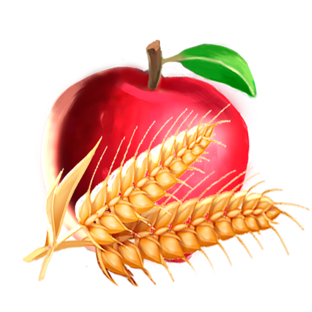
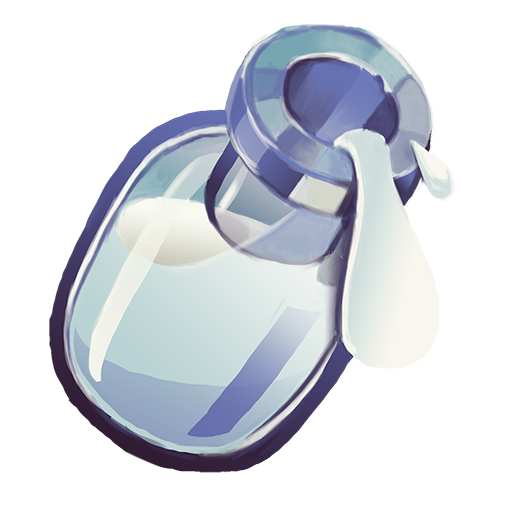
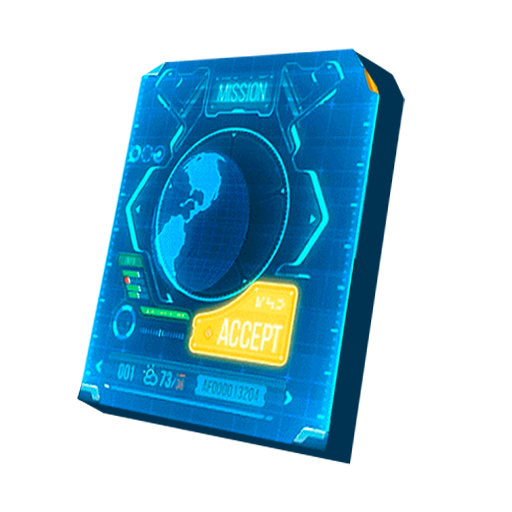
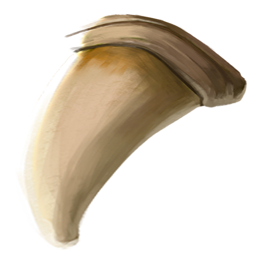
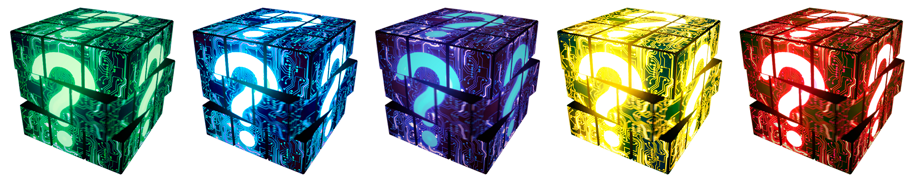
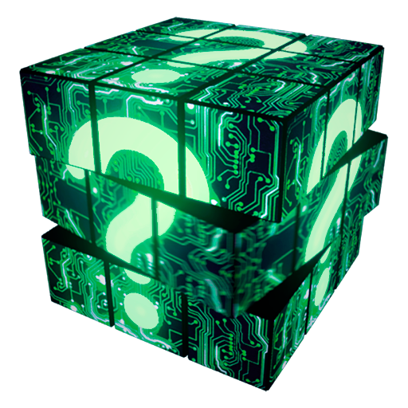
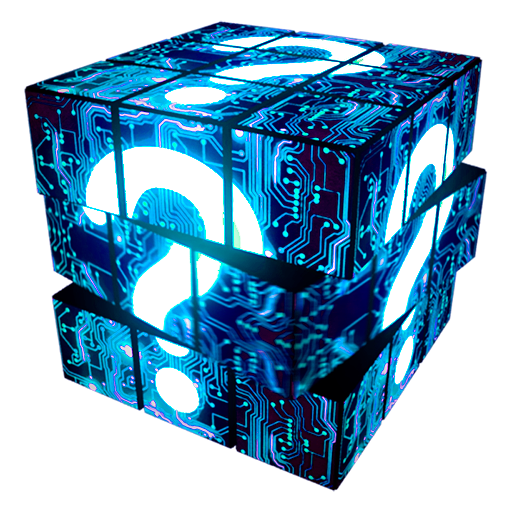
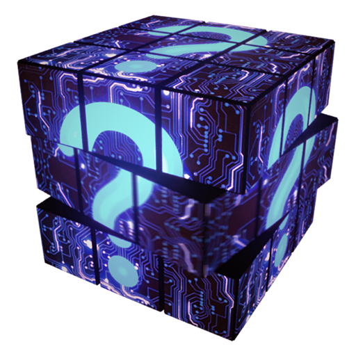
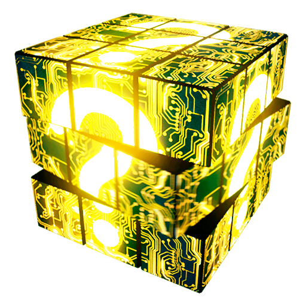
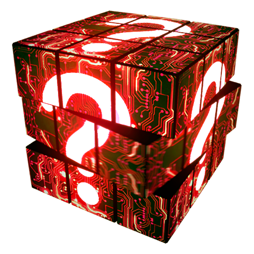

# Currency

The lands of **STEM 2801** are filled with riches: from gems and stones to rare materials and the most delicious ingredients. Many MINDS ventured onwards trying to retrieve such precious goods, however, few managed to return victorious for the journey is hard and filled with peril.&#x20;

MINDS sent on missions might return with some of the following resources. These will later be used to unlock and upgrade more features of Neuropia. Gather them and bring them to the Artisan for crafted items. A MIND’s statistics: Frontal, Motor, Temporal, its SRT, and rarity will influence how many resources the MIND can retrieve, how fast, and the probable rate of success for the mission. Choose carefully which MIND goes in which mission in order to get the most resources and uncover the story!

### Aurorium

.png>)****

Commonly found around the Whispering Mountains, <mark style="color:yellow;">**Aurorium**</mark> is a versatile metal that can be forged and minted easily into coins. It's less efficient at conducting heat or electricity, which is why it has been mostly used for its malleable quality. The coins are not minted to serve any ruler or King, they have the same symbol representing minds.

### Building Materials

.png>)

Building materials are just that. You obtain them from hard labour, refine them through manufacture or... just steal them. Used to build stuff.

### Food

****

The vast fields surrounding Motormont are rich with orchards and plots of land tended by hard-working MINDS. Travellers are welcomed to grab food as they go along, however, some Whooves guarding the crops might be less hospitable. It is said that bringing a piece of Moomoo meat with you on travels brings good fortune.

### Mindtrap Milk

The vastity of the flora in Pond Pons is well-known in the **MIND** world. Many protected species live there, including the Mindropophagite Mindtrap. It produces a substance with enormous health benefits. Although extraction helps the plant grow as well, it is posing difficulty due to the aggressive nature of the Mindtrap. Mindtrap Milk is, therefore, an expensive ailment and nourishment source.

### Data Sheet

Data Sheets allow the development of new strategies of research. They are able to store a lot of information securely and allows complex data to be transferred instantaneously. They are very expensive to produce

### Deed

.png>)

Deeds have once been emitted to attest formal agreements that were made between **MINDS**. They were written in the old language and many older MINDS have kept them around as memorabilia or to hand them down as family heirlooms. Deeds have no expiration

### Tickets

In the old days, tickets were used by **MINDS** to obtain access to various parts of the world. They were used as recommendation letters, passports, and subscriptions alike. Although the world has been free for movement for centuries now, the tickets hold historical value and are considered to be still valid.

### Lore Fragment

****

Written by old trembling hands, these are live retellings of the past. They hold immense power and reveal the truth of otherwise old and forgotten tales and moments. They capture a moment in time and manage to bring forth lessons and knowledge from decades and centuries ago. They need to be treated with care and considered fragile pieces of **MIND** history.

### Persidian

.png>)

Found in the rapids of the rivers and creeks around, this previous gem is known for its curative properties. It is said to protect MINDS from memory loss and bring calm to a stressed MIND. The most important pieces of jewelry created in MIND history have been embedded with this.

### Phloxium

.png>)****

With its unique refracting properties and a strength that exceeds diamonds tenfold, this gem is very valuable. It has a multitude of uses, from jewelry to creating tools. Its extraction process is incredibly difficult, sometimes teams of MINDS, or special equipment is needed to extract even a small piece. An old wives tale says MINDS wishing to procreate will have better luck if they gift some Phloxium gems.

### Shabby Tooth

Squirodile teeth are strong and durable as a material and have been used for centuries in the making of tools and other equipment. The teeth sometimes fall out on their own since squirodiles change 7 sets of teeth in their lifecycle but most of the time, you need to just get them yourself.&#x20;

### Consolation Cookies

.png>)

Legend says that a brave MIND of old, serving his king, Mindelaos's command, left to retrieve an old forgotten scroll hidden near the Monroe Maw. He traveled long and far, he trained and fought bravely, but returned empty-handed. The King's anger deepened as he heard the hero's explanation. Mindelaos saw how humble and ashamed the hero was, he knew nobody will hire the hero again if he leaves his castle without a reward. The King looked around and saw a cookie on a plate nearby. He gifted the hero the cookie as a consolation reward. Since then, it's been a custom to serve consolation cookies to those who fought bravely yet did not find victory this time.

### Thoughtless Box

Find a <mark style="color:green;">**Thoughtless Box**</mark> throughout Neuropia. They offer varied treasures within, based on their respective Rarities.

### Potion of Swiftmind

Use this if you run out of Energy. Can be crafted at the artisan or looted in a <mark style="color:green;">**Thoughtless Box**</mark>.
