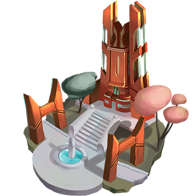

# METAVERSE

**Findings log. Entry 710:**

Over the last months, we have observed the MINDS, and their evolution path is astounding. The speed at which they advance through technological progress far exceeds all expectations. They have recently crossed what we would call an Industrialization phase and are now using machinery to exploit their natural resources. Some communities have taken over regions as their own in the development process. Richness created hierarchies. One MIND solely controls one of their primary transportation resources, which sparked conflict between the MINDS in the area. Believe it or not, the tycoon is... it's... it's Larry.


**Good to know:** As a land-owner type game, **MIND: Metaverse** involves investing and upgrading the production of various resources, which are used to unlock more avenues of earning rewards and in-game currencies and develop your territories further. Properties can be sold, rented and their value increases based on the level of development. Grow your territories, extract and process all resources, trade on the market with other players, and become the wealthiest.


