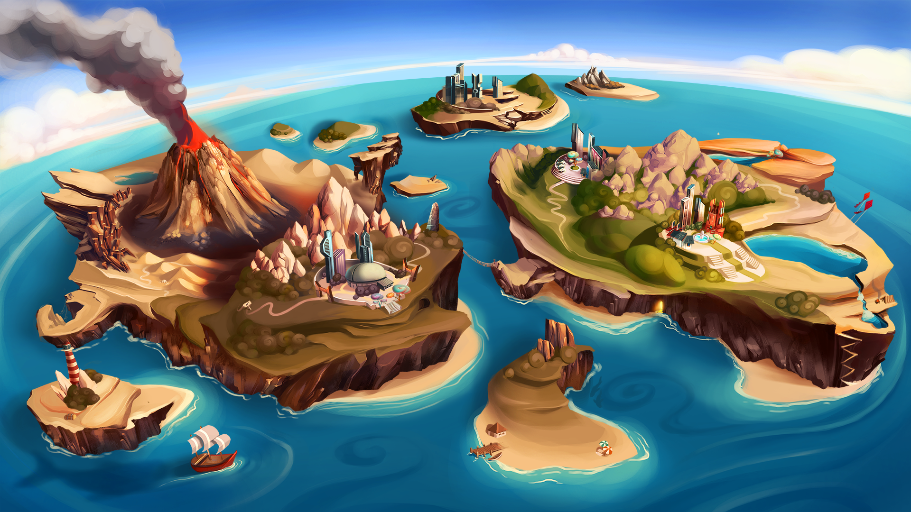

# NEUROPIA

Neuropia is a solo adventure mode with missions that bring rewards and resources. These are later used to develop your settlement within the MIcdNDS world. The Story will unveil further regarding the history and lore of the MINDS, new characters emerge, plot twists, and, of course,........cliff han-.

**Findings log 5:**&#x20;

The MINDS are more complex than we thought. They organize their daily existence as part of a neural network, a settlement sustained by all members of a community. They build shelters and improve them as more resources come in. The MINDS takes up various community roles, similar to our hunters-scavengers, explorers, builders, and merchants. My fellow researchers have concluded that the key to their development is getting production levels to optimal functionality and maintaining it. Except for Larry, Larry does nothing!


**Good to know:** In Neuropia, you can grow and upgrade your NFT cards to get better statistics and earn more rewards to use in the entire MIND Universe. Construct new buildings, upgrade them and explore the map; send your MINDS on quests and reap the benefits. Create production lines and unlock new avenues to gain passive in-game income. Similar to staking, send your NFTs on daily missions to return with plenty of rewards!

