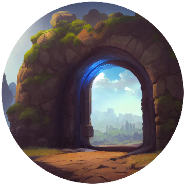
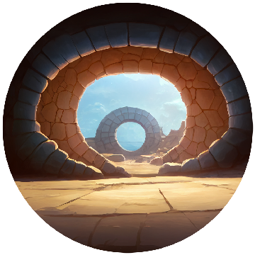

# ⚒ Artisan

## Overview:&#x20;

* Craft new items from in-game resources
* Go on Quests and gain resources

Looking for a lingot, some building materials, some Kale fat? Chances are, the Artisans can craft it for you. All you need to do is bring them the required ingredients and if they know the recipe they’ll make it in no time!&#x20;


Players can transform their current resources into new ones to access more features of the MIND Games Universe. Once crafted, the new item cannot be taken apart back into its original ingredients.


## Quests:

**Callos Expedition**

<figure><figcaption></figcaption></figure>

Embark on the thrilling Callos Expedition, an exciting journey through mysterious lands filled with unexpected challenges. Test your skills as you navigate unfamiliar terrain, encounter fascinating creatures, and reveal ancient secrets. Only the most skilled adventurers will succeed, claiming the impressive rewards and riches that await the intrepid explorers. Are you ready for the adventure?

**Rewards**&#x20;

.png>).png>).png>)

**Thalamos Expedition**

<figure><figcaption></figcaption></figure>

Embark on the Thalamos Expedition, where bountiful rewards await the daring. Uncover hidden secrets and traverse enigmatic landscapes to claim unparalleled treasures. Seize the opportunity and reap the spoils reserved for the boldest explorers. Will you rise to the challenge?

**Rewards**&#x20;

.png>).png>).png>)
