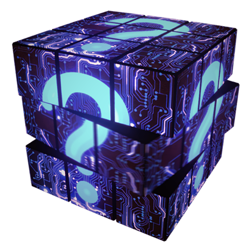

# 🍪 Missions

The[ **P.O.R.T.A.L**](p.o.r.t.a.l..md)**.** shows signs of activity once more. It has been used by explorers and travellers to reach faraway places within seconds, yet no one knows for sure how it works.

 2.png>)

### Cryptography

Near Somis lake is a place where talented MINDS, with years of cryptography experience**,** can unlock the long-sought [<mark style="color:yellow;">**\[CRX\]**</mark>](../../../how-it-works/brain-cell-token.md). The road leading up to the lake is not an easy one to follow, with its sharp turns and unforgiving weather. Even if adventurers make it all the way, there is no guarantee all will return safely.


Send a [<mark style="color:blue;">**Sensor**</mark>](../nfts/minds/classes.md) or a [<mark style="color:blue;">**Melder**</mark>](../nfts/minds/classes.md) to Unlock <mark style="color:yellow;">**LOCKED**</mark> [<mark style="color:yellow;">**CRX**</mark>](../../../how-it-works/brain-cell-token.md) obtained from [<mark style="color:blue;">**Piero's Statue**</mark>](../../../how-it-works/pieros-statue.md#overview) into [<mark style="color:yellow;">**\[CRX\]**</mark>](../../../how-it-works/brain-cell-token.md) or [<mark style="color:orange;">**Building Materials**</mark>](../currency.md#building-materials)


### Soul Casting

Gathering souls is a task only some **MINDS** can accomplish. Ever less know how to cast the souls into new materials. Apparently one must take the souls on the peak of Mount Broca and as the lightning strikes the narrow shrine placed there, use a secret phrase and obtain <mark style="color:yellow;">**AUR**</mark> from it.


Send a [<mark style="color:yellow;">**Leech**</mark>](../nfts/minds/classes.md) or a [<mark style="color:yellow;">**Thinker**</mark>](../nfts/minds/classes.md) Try casting a soul into <mark style="color:yellow;">**AUR**</mark> or [<mark style="color:orange;">**Building Materials**</mark>](../currency.md#building-materials)


### Seafair

The Grieving Nixie is docked in Wernicke bay awaiting her Captain. **MINDS** that embark on this voyage return with great treasures of [<mark style="color:yellow;">**\[CRX\]**</mark>](../../../how-it-works/brain-cell-token.md) . Waters are often unforgiving and keep the sailors captive deep down under. Only the worthy can escape and reach the shore once more.


Send a <mark style="color:red;">**Wave**</mark> or a <mark style="color:red;">**Node**</mark> to get [<mark style="color:yellow;">**\[CRX\]**</mark>](../../../how-it-works/brain-cell-token.md)  or [<mark style="color:orange;">**Building Materials**</mark>](../currency.md#building-materials). Will only reward [<mark style="color:yellow;">**\[CRX\]**</mark>](../../../how-it-works/brain-cell-token.md)  if there are [**offerings**](../../../how-it-works/pieros-statue.md#locking) made on the specific pairs.


### Fable Binding

Explore the furthest corners of <mark style="color:blue;">**STEM 2801**</mark> to uncover the history of **MINDS** as they were written by authentic witnesses. Who knows what mysteries will be uncovered, what secrets unveiled?


Receive <mark style="color:orange;">**Lore Fragments**</mark> and the occasional [<mark style="color:green;">**Thoughtless Box**</mark>](../currency.md#thoughtless-box) throughout Stem's lush biomes.&#x20;


### The Registrar

Need paperwork? The incredibly tedious bureaucratic sector of the MIND universe makes it easier to bypass than follow official routes. You need some documents or papers? Get a job at The Registrar, get all the documents you need from here.&#x20;


Receive <mark style="color:blue;">**Deeds**</mark> and [<mark style="color:green;">**Thoughtless Box**</mark>](../currency.md#thoughtless-box) by doing your taxes and filings.


### Extraction

The bays and archipelagoes of the **MIND** world are filled with wondrous creatures. Look for the tracks, study their environment and lifestyle and see if you can find some valuable resources along the way.


Receive [<mark style="color:orange;">**Shabby Tooth**</mark>](../currency.md#shabby-tooth) **and** [<mark style="color:green;">**Thoughtless Box**</mark>](../currency.md#thoughtless-box) from various contracted quests.


### Refreshments


Refresh your [**MIND MOXIE**](../nfts/minds/mind-moxie.md) on your worn-out **MINDS** by feeding them your collected Food. &#x20;

