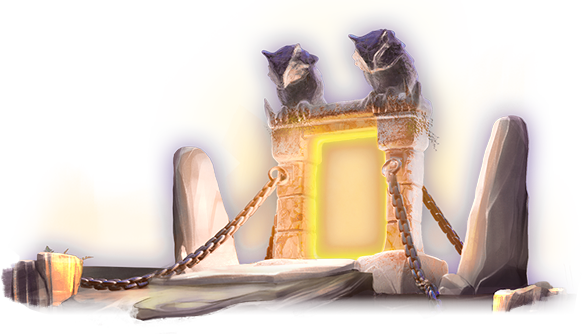

# 🦉 P.O.R.T.A.L.

### Overview:&#x20;

* Explore Neuropia’s surroundings&#x20;
* Send MINDS on missions and retrieve rewards

The Path-Opening Relique Transcending Archaic Locations can transport beings in different places. How it works exactly is still a mystery even to the greatest of MINDS. Traveling through it takes mere seconds. MINDS are unsure how far can one travel by this PORTAL: Does this only work in Neuropia? Can you get on another part of the planet? Can you travel to outer space?


Players can use the portal to access the second game mode. You can send MINDS on missions using the portal, and they will retrieve rewards. More about Neuropia and the game mode can be found here.

