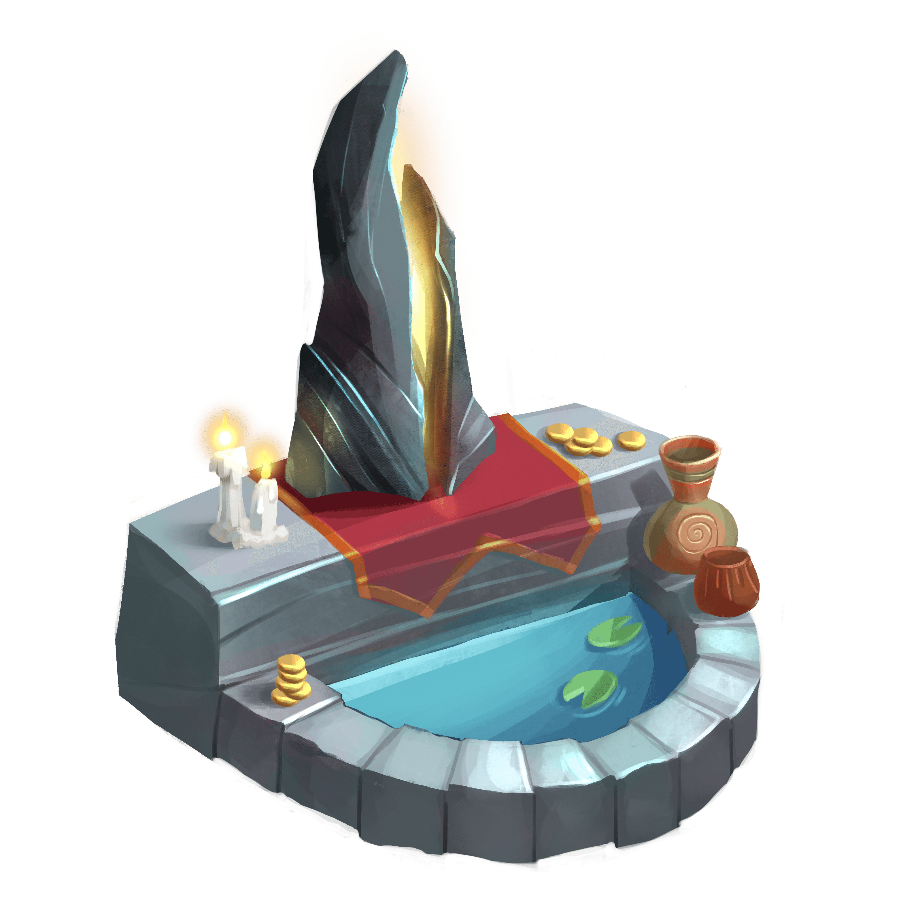

# 👬 Sanctum

As an advanced race, the MINDS have long surpassed the traditional reproduction techniques. Instead, to ensure the population is at optimum levels, they have perfected the art of multiplication. For them, it is known as Brain Storming.

Two MINDS meet. They feel an instant connection. Coincidentally they stumble upon each other again near the Sanctum. They share some thoughts. Some ideas clash, tension intensifies, bonds grow stronger. Distracting ideas take over. Brain waves propagate faster. Brain teasers. One secret slips off a shoulder of insecurities. Meaningful intentions. Contact. One consciousness, one awareness, one mind. Senses activate, neurons tremble, overwhelming stimuli, notions, electricity, memories, links, breaths, suspense. … And from their spark, another MIND emerges. Sigh, Too bad they've got to bring paperwork, dowry.


Players can make two MINDS Brain Storm to multiply them. In order to do this, several tokens and resources will be required. The statistics and traits of the newly created MIND can vary from its original ancestors.



<mark style="color:yellow;">**CELL**</mark> collected by the **Brain Storming** event will be distributed as follows:&#x20;

**%** Vault

**%** Research Facility&#x20;

**%** Burn\
\
**​Disclaimer:** Due to the great care a game economy requires, the specific numbers regarding the redistribution of <mark style="color:yellow;">**CELL**</mark> may be susceptible to change.&#x20;

