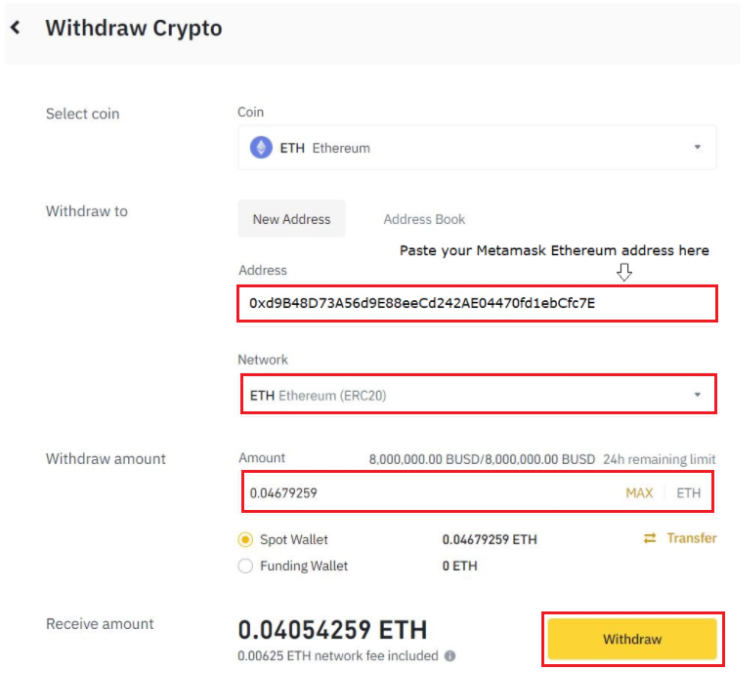

# Brainstorming

<figure><figcaption></figcaption></figure>


If you see two MINDS heading to the Sanctum...it's safe to say, there will be more than a spark between them!


<mark style="color:blue;">**Brainstorming**</mark>, the process of MIND multiplication on STEM 2801. The exact processes and transformations that go on are still unknown to our Researchers, however, they are crafting various hypotheses. So far they have observed the following:

<mark style="color:blue;">**Brainstorming**</mark> requires two MINDS, which we will refer to as the Original ones. When the Originals Brainstorm, then the new MIND created has a chance to be of a higher rarity than they were. What makes any MIND unique is its traits: rarity, class, set and abilities (spells, IQ and SRT). Think of these as the MIND's status, personality, occupation, genetic predispositions, strengths and weaknesses.

Based on the above table you can guide your Brain Storming process. The 2 original MINDS can have one of two roles. These will determine different aspects of the future MIND's traits. Once the Brainstorming process is complete and they Stormsurge, the two Originals, need time to rest. If they are Elders the resting period will be 24 hours. If they are subsequent generations, the resting time will increase.

<mark style="color:purple;">**Stormsurge**</mark> happens at the end of the Brainstorming process and brings to life the new MIND.

**Gene Multiplication**

As far as the MINDS Genetic makeup is concerned, a few things differ from our own.&#x20;

Elder MINDS are the ones that have Stormsurged the entire race. They are to be protected at all costs.

Combine any 2 Rarities and get a chance to get a higher rarity card.

**Inheritance**

MINDS have very special traits and abilities. Some of these they get from their Originals and some of them are received through their Class or Rarity.

10% Chance to get a higher rarity&#x20;

30% Rarity of the highest card&#x20;

55% Rarity of the lower card&#x20;

5% Lower rarity

If the New MIND is the same Rarity or lower than the Originals lowest Rarity

10% chance of +5 Main Stat

20% chance of -5 Main Stat

70% no change

If the New MIND is the same Rarity or higher than the Originals highest Rarity

10% chance of +10 Main Stat

30% chance of +5 Main Stat

60% no increase

**Transference**

The newly created MIND will belong to the Set:

40% chance of Cloner

45% of Clonee

5% Wild

10% Mutate to other Set

The Original with the lowest number of available brainstorms will pass on the number to the newly Stormsurged MIND. Elders are exempt from this as they have the power to Brainstorm indefinitely. \
\
i.e. Gen3 MIND \[8 Brainstorms Remaining / 8 Brainstorms Available] + Gen4 MIND \[2 Brainstorms Remaining / 7 Brainstorms Available] = Gen5 MIND \[2 Brainstorms Remaining / 2 Brainstorms Available]\
\
Stormsurging will create a new MIND whose generation is determined by checking the Originals Generations and adding plus one to the Highest of the two.

i.e.  Gen3 MIND + Gen9 MIND = Gen10 MIND&#x20;

**Wind down**

After a long process in which the two MINDS put their heads together to bring a new one into existence, they need to rest.&#x20;

Gen 0 MINDS Will have a 24h Wind Down Period ( based on block ) and subsequent Generations will have a higher rate.

_Wind Down = 24h+(24h\*Gen)_

**Renting for Stormsurge**

MINDS can be also offering to help other MINDS perpetuate the intellect of their genes. The players who rent out their MINDS will establish the price.\


The breed cost of those NFTs will stay the same, regardless if the NFTs are both yours or if one is rented.


## Cost and Particularities

Brainstorming 2 MINDS together requires tremendous attention.


Brainstorming 2 MINDS of the same bloodline is not possible. There have been attempts in the past, but let's not talk about them.&#x20;


| Elders Generation 0 | CRX | FOOD | AURORIUM | PHLOXIUM |
| ------------------- | --- | ---- | -------- | -------- |
| Brainstorm 1        | 5   | 200  | 100      | 1        |
| Brainstorm 2        | 10  | 220  | 102      | 3        |
| Brainstorm 3        | 15  | 240  | 104      | 5        |
| Brainstorm 4        | 20  | 260  | 106      | 7        |
| Brainstorm 5        | 25  | 280  | 108      | 9        |
| Brainstorm 6        | 30  | 300  | 110      | 11       |
| Brainstorm 7        | 35  | 320  | 112      | 13       |
| Brainstorm 8        | 40  | 340  | 114      | 15       |
| Brainstorm 9        | 45  | 360  | 116      | 17       |
| Brainstorm 10       | 50  | 380  | 118      | 19       |
| Infinity            | 55  | 400  | 120      | 21       |

| Minds Generation 1 | CRX | FOOD | AURORIUM | PHLOXIUM |
| ------------------ | --- | ---- | -------- | -------- |
| Brainstorm 1       | 15  | 300  | 110      | 2        |
| Brainstorm 2       | 20  | 320  | 112      | 4        |
| Brainstorm 3       | 25  | 340  | 114      | 6        |
| Brainstorm 4       | 30  | 360  | 116      | 8        |
| Brainstorm 5       | 35  | 380  | 118      | 10       |
| Brainstorm 6       | 40  | 400  | 120      | 12       |
| Brainstorm 7       | 45  | 420  | 122      | 14       |
| Brainstorm 8       | 50  | 440  | 124      | 16       |
| Brainstorm 9       | 55  | 460  | 126      | 18       |
| Brainstorm 10      | 60  | 480  | 128      | 20       |

| Minds Generation 2 | CRX | FOOD | AURORIUM | PHLOXIUM |
| ------------------ | --- | ---- | -------- | -------- |
| Brainstorm 1       | 25  | 400  | 120      | 3        |
| Brainstorm 2       | 30  | 420  | 122      | 5        |
| Brainstorm 3       | 35  | 440  | 124      | 7        |
| Brainstorm 4       | 40  | 460  | 126      | 9        |
| Brainstorm 5       | 45  | 480  | 128      | 11       |
| Brainstorm 6       | 50  | 500  | 130      | 13       |
| Brainstorm 7       | 55  | 520  | 132      | 15       |
| Brainstorm 8       | 60  | 540  | 134      | 17       |
| Brainstorm 9       | 65  | 560  | 136      | 19       |

| Minds Generation 3 | CRX | FOOD | AURORIUM | PHLOXIUM |
| ------------------ | --- | ---- | -------- | -------- |
| Brainstorm 1       | 35  | 500  | 130      | 4        |
| Brainstorm 2       | 40  | 520  | 132      | 6        |
| Brainstorm 3       | 45  | 540  | 134      | 8        |
| Brainstorm 4       | 50  | 560  | 136      | 10       |
| Brainstorm 5       | 55  | 580  | 138      | 12       |
| Brainstorm 6       | 60  | 600  | 140      | 14       |
| Brainstorm 7       | 65  | 620  | 142      | 16       |
| Brainstorm 8       | 70  | 640  | 144      | 18       |

| Minds Generation 4 | CRX | FOOD | AURORIUM | PHLOXIUM |
| ------------------ | --- | ---- | -------- | -------- |
| Brainstorm 1       | 45  | 600  | 140      | 5        |
| Brainstorm 2       | 50  | 620  | 142      | 7        |
| Brainstorm 3       | 55  | 640  | 144      | 9        |
| Brainstorm 4       | 60  | 660  | 146      | 11       |
| Brainstorm 5       | 65  | 680  | 148      | 13       |
| Brainstorm 6       | 70  | 700  | 150      | 15       |
| Brainstorm 7       | 75  | 720  | 152      | 17       |

| Minds Generation 5 | CRX | FOOD | AURORIUM | PHLOXIUM |
| ------------------ | --- | ---- | -------- | -------- |
| Brainstorm 1       | 55  | 700  | 150      | 6        |
| Brainstorm 2       | 60  | 720  | 152      | 8        |
| Brainstorm 3       | 65  | 740  | 154      | 10       |
| Brainstorm 4       | 70  | 760  | 156      | 12       |
| Brainstorm 5       | 75  | 780  | 158      | 14       |
| Brainstorm 6       | 80  | 800  | 160      | 16       |

| Minds Generation 6 | CRX | FOOD | AURORIUM | PHLOXIUM |
| ------------------ | --- | ---- | -------- | -------- |
| Brainstorm 1       | 65  | 800  | 160      | 7        |
| Brainstorm 2       | 70  | 820  | 162      | 9        |
| Brainstorm 3       | 75  | 840  | 164      | 11       |
| Brainstorm 4       | 80  | 860  | 166      | 13       |
| Brainstorm 5       | 85  | 880  | 168      | 15       |

| Minds Generation 7 | CRX | FOOD | AURORIUM | PHLOXIUM |
| ------------------ | --- | ---- | -------- | -------- |
| Brainstorm 1       | 75  | 900  | 170      | 8        |
| Brainstorm 2       | 80  | 920  | 172      | 10       |
| Brainstorm 3       | 85  | 940  | 174      | 12       |
| Brainstorm 4       | 90  | 960  | 176      | 14       |

| Minds Generation 8 | CRX | FOOD | AURORIUM | PHLOXIUM |
| ------------------ | --- | ---- | -------- | -------- |
| Brainstorm 1       | 85  | 1000 | 180      | 9        |
| Brainstorm 2       | 90  | 1020 | 182      | 11       |
| Brainstorm 3       | 95  | 1040 | 184      | 13       |

| Minds Generation 9 | CRX | FOOD | AURORIUM | PHLOXIUM |
| ------------------ | --- | ---- | -------- | -------- |
| Brainstorm 1       | 95  | 1100 | 190      | 10       |
| Brainstorm 2       | 100 | 1120 | 192      | 12       |

| Minds Generation 10 | CRX | FOOD | AURORIUM | PHLOXIUM |
| ------------------- | --- | ---- | -------- | -------- |
| Brainstorm 1        | 105 | 1200 | 200      | 11       |
