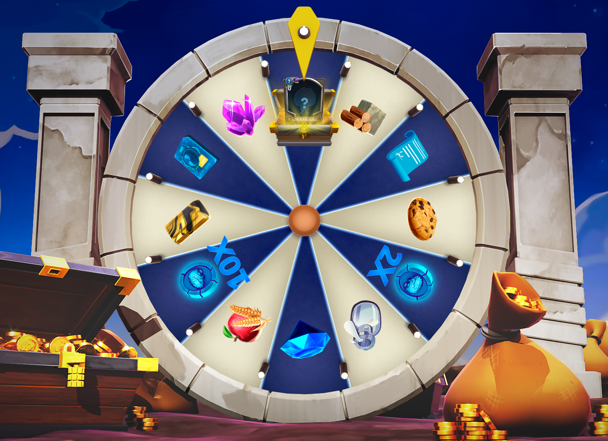

# 🎡 Wheel of Gnomon

<figure><figcaption></figcaption></figure>

The MINDS often find comfort spinning the wheel of Gnomon. Holding a small deposit of <mark style="color:yellow;">**CELL**</mark>, the MINDS spin this wheel to get omens of their day. Having no scientific reasoning, it proves as a useful whimsical tool to help MINDS feel more spirituality. Life without uncertainty would be like a MIND dinner without Kale.


Players can use this mini-game to place an amount of <mark style="color:yellow;">**CELL**</mark> and spin the wheel to double it or even receive a monumental x10, or Gnomon will omnomnom it. The wheel can be spun an unlimited amount of times per day.



<mark style="color:yellow;">**CELL**</mark> collected by the **Wheel of Gnomon** will be redistributed to the W.o.G. reward pool, Vault, Research Facility, and Burn.&#x20;

\
**​Disclaimer:** Due to the great care a game economy requires, the specific numbers regarding the redistribution of <mark style="color:yellow;">**CELL**</mark> may be susceptible to change.&#x20;


<figure><figcaption></figcaption></figure>

## The Ticket System&#x20;

Each offering to Gnomon, or spin of the Wheel is done by using the ancient ticketing system. Depending on the size of your problem, for instance, for a circumvolution fungus, you might want a <mark style="color:green;">**\[Common Ticket]**</mark>, or if you want to rule the world and overthrow the Monarchy, you might want a <mark style="color:purple;">**\[Legendary Ticket]**</mark> and for anything in between, well, the <mark style="color:yellow;">**\[Rare Ticket]**</mark>.

The rewards Gnomon offers for spinning his wheel also differ in size and proportion to the Ticket you use.&#x20;

| QUANTITY            | COMMON | RARE | LEGENDARY |
| ------------------- | ------ | ---- | --------- |
| 10X CELL            | 1000   | 5000 | 10000     |
| 2X CELL             | 200    | 1000 | 2000      |
| Building Materials  | 1      | 5    | 10        |
| Aurorium            | 5      | 10   | 20        |
| Persidian           | 1      | 2    | 3         |
| Phloxium            | 1      | 2    | 3         |
| Deeds               | 1      | 2    | 3         |
| Data Sheets         | 1      | 2    | 3         |
| Food                | 1      | 5    | 10        |
| Consolation Cookies | 1      | 5    | 10        |
| Mindtrap Milk       | 1      | 5    | 10        |
| NFT                 | 1      | 1    | 1         |
