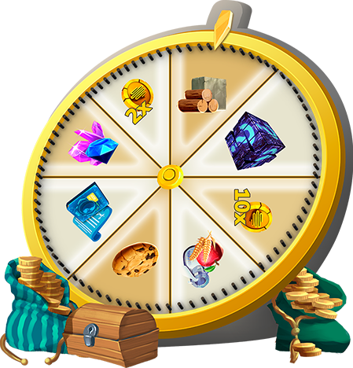

# 🎡 Wheel of Gnomon

The MINDS often find comfort spinning the wheel of Gnomon. Holding a small deposit of <mark style="color:yellow;">**CELL**</mark>, the MINDS spin this wheel to get omens of their day. Having no scientific reasoning, it proves as a useful whimsical tool to help MINDS feel more spirituality. Life without uncertainty would be like a MIND dinner without Kale.


Players can use this mini-game to place an amount of <mark style="color:yellow;">**CELL**</mark> and spin the wheel to double it or even receive a monumental x10, or Gnomon will omnomnom it. The wheel can be spun an unlimited amount of times per day.



<mark style="color:yellow;">**CELL**</mark> collected by the **Wheel of Gnomon** will be redistributed to the W.o.G. reward pool, Vault, Research Facility, and Burn.&#x20;

\
**​Disclaimer:** Due to the great care a game economy requires, the specific numbers regarding the redistribution of <mark style="color:yellow;">**CELL**</mark> may be susceptible to change.&#x20;


