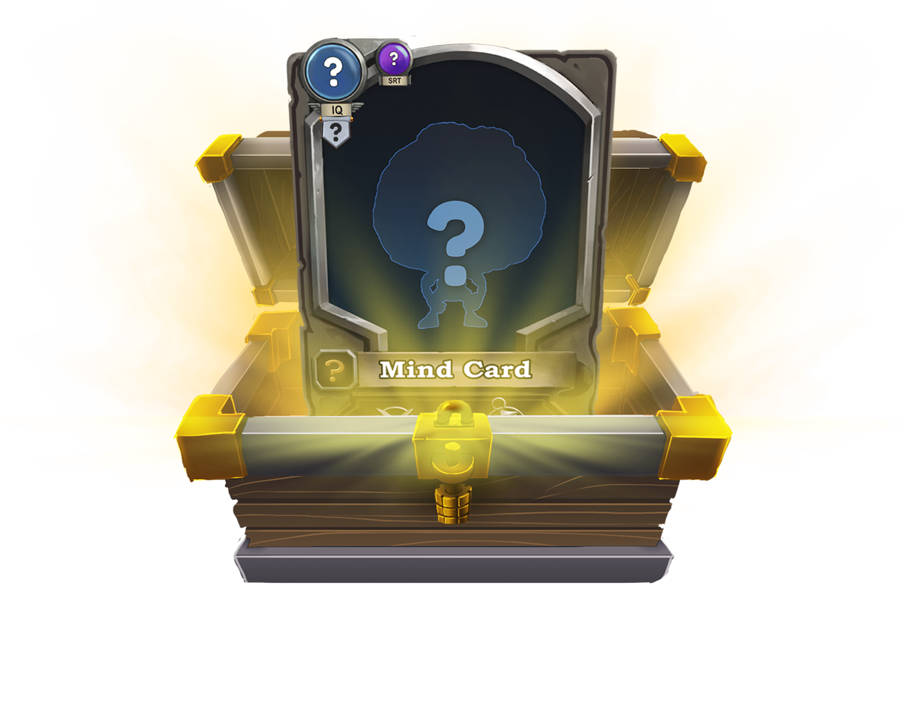

# NFTs

NFTS intro: Research log: “So far, we know their society functions based on classes, on rarities. They seem to have certain social groups and tend to remain in close proximity to them. Some are very active and dynamic, others tend to dwell in arts & crafts. There seem to be 10 different communities. The largest one we found, contains 10 unique individuals. We assume most communities have around 10 unique types, however, we were only able to find some of them. The team is keeping an eye out. Wait a minute, I didn’t see that before...What even is that thing?! „


****

