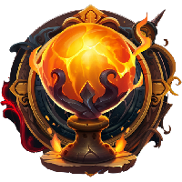

# Classes

.png>)

**Thinker**

Hard-shelled minds that attract all focus towards them. They excel at making other MINDS frustrated. This mind has strong repelling capabilities but little direct repost.

<mark style="color:green;">SRT: 0.4-0.8</mark>&#x20;

<mark style="color:yellow;">Frontal : 35-50</mark>

<mark style="color:red;">Motor : 15-30</mark>

<mark style="color:blue;">Temporal : 5-20</mark>

.png>)

**Node**

Mean, mean MINDS of motor misfortune! The Nodes deal constant motor damage and are exquisite at evasive manoeuvers. They love playing Hide-and-Wreak.

<mark style="color:green;">SRT: 0.6-1</mark>&#x20;

<mark style="color:yellow;">Frontal : 15-30</mark>

<mark style="color:red;">Motor : 20-40</mark>

<mark style="color:blue;">Temporal : 15-25</mark>

**Sensor**

Mystic and ruthless, Sensors are sure to leave a mark on other MINDS should they get their chance. Harnessing such great power costs these MINDS protection.

<mark style="color:green;">SRT: 0.5-1.2</mark>&#x20;

<mark style="color:yellow;">Frontal : 5-10</mark>

<mark style="color:red;">Motor : 10-15</mark>

<mark style="color:blue;">Temporal : 35-55</mark>

.png>)

**Leech**

Adamant and stubborn, these MINDS are known to profit from others to sustain themselves. They are likely to bounce back many times before anyone manages to knock them down for good.

<mark style="color:green;">SRT: 0.4-0.8</mark>&#x20;

<mark style="color:yellow;">Frontal : 25-35</mark>

<mark style="color:red;">Motor : 5-15</mark>

<mark style="color:blue;">Temporal : 15-35</mark>

.png>)

**Wave**

Resisting these MINDS over and over again can prove to be a challenge even to the most skilled player. Waves deal frequent damage that can turn a battle around one hit at a time.

<mark style="color:green;">SRT: 0.6-1</mark>

<mark style="color:yellow;">Frontal : 15-35</mark>

<mark style="color:red;">Motor : 25-35</mark>

<mark style="color:blue;">Temporal : 5-15</mark>

.png>)

**Melder**

Reaching an equilibrium comes naturally to Melders as they are skilled fighters. They are reliable and always think outside the box.

<mark style="color:green;">SRT: 0.5-1.2</mark>&#x20;

<mark style="color:yellow;">Frontal : 15-35</mark>

<mark style="color:red;">Motor : 5-15</mark>

<mark style="color:blue;">Temporal : 25-35</mark>
