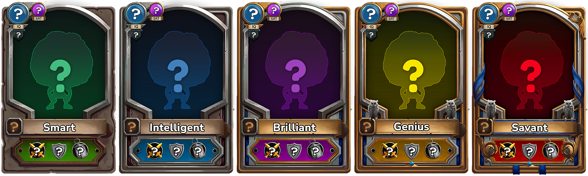

# Rarities

Rarities are a descriptor for a card's power and uniqueness. There are five levels of Rarity, from Smart to Savant. Each part of the game will use Rarity differently.


Rarities are essential in every aspect of the game, by giving base statistics or creating boundaries and generating value.&#x20;


<mark style="color:green;">**Smart**</mark>

In a world of geniuses, the smart man is average. No mistaking that this is the lowest of the rarities but don't be worried, there are ways of increasing this later.

<mark style="color:blue;">**Intelligent**</mark>

Holding an above basic intelligence, this Rarity is the next step in your cards' journey to true collectible zen.

<mark style="color:purple;">**Brilliant**</mark>

The most relatable of all rarities, Brilliant includes basic abilities. Not the most exciting of rarities, yet it's indispensable to complete the set.

<mark style="color:yellow;">**Genius**</mark>

Sitting on the cusp of MIND fame, Genius cards are valuable to every collection. They shine above the majority of others and have just one more step to take to reach a rarity zenith.

<mark style="color:red;">**Savant**</mark>

The star of the NFT "carddom", having reached the pinnacle of the rarities, Savants look down at all the other rarities and lavish in their precociousness.
