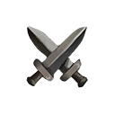
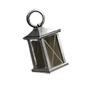

# Stats

### Main Stat

We all have our strengths and weaknesses. Due to the advanced way they live, **MINDS** discovered and implemented a system where **MINDS** mainly function on their strongest skill, thus increasing their productivity level. At the last demographic questionnaire, for the question regarding their biggest weakness, most **MINDS** replied with "Kale".


All cards are minted with three statistics: **Frontal**, **Motor**, and **Temporal**. These influence a card's class and determine which roles they are better suited for.


### <mark style="color:yellow;">**Frontal**</mark>

The Frontal statistic reflects a MIND's resilience. It usually characterizes ambitious ones, able to withstand most obstacles they encounter. They are good at controlling their reaction towards the environment.

### <mark style="color:red;">**Motor**</mark>

The Motor statistic reflects a MIND's will. MINDS are usually very adamant about their volition and are not afraid to show it. These ones are very reactive towards the environment.

### <mark style="color:blue;">**Temporal**</mark>

The Temporal statistic reflects a MIND's power of persuasion. MINDS with Temporal as the Main Stat are patient and use this to coerce their opponents. They emphasized their statement and make use of all the weak points of the enemy. Similar to Motor MINDS, these also react to stimuli from the environment, making them more suitable for attacks.
