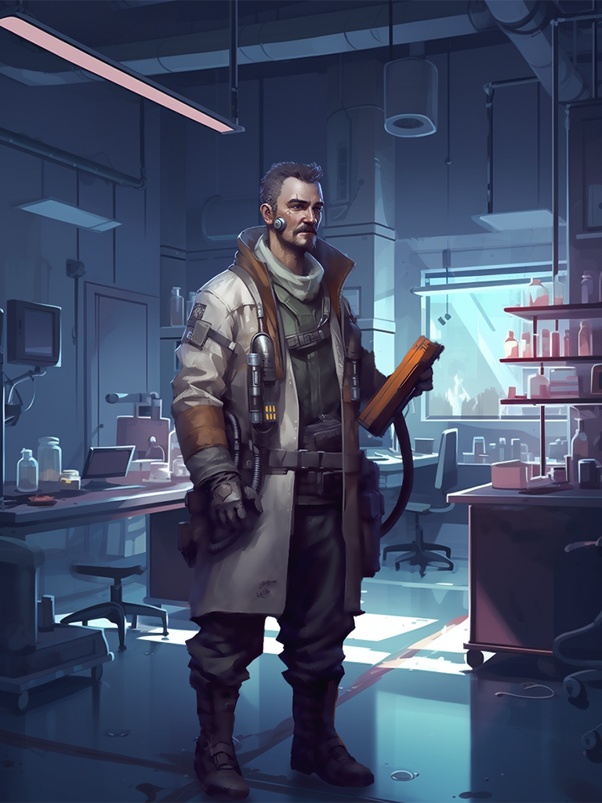
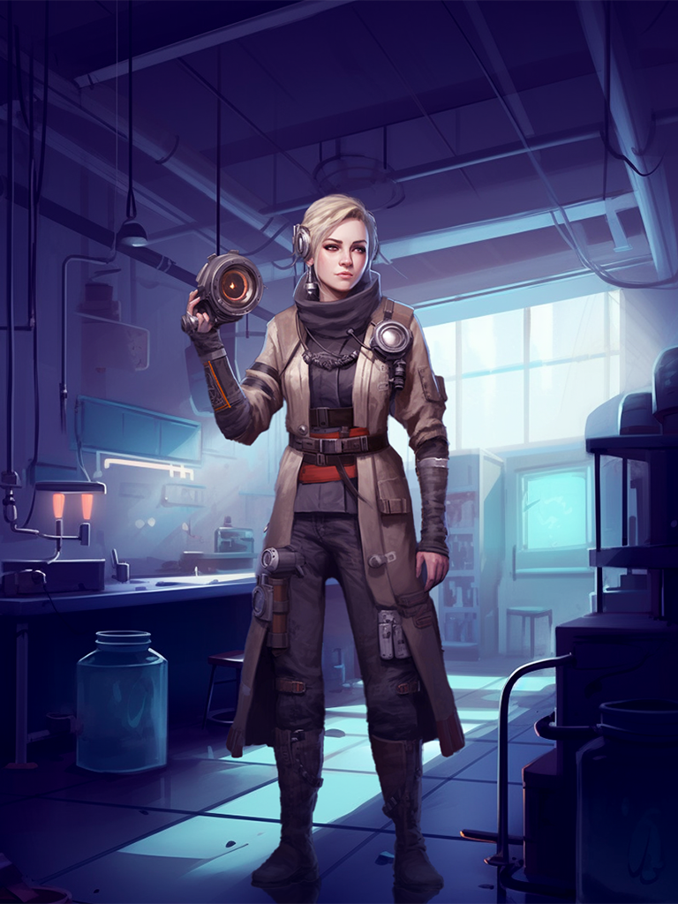

# 🔭 Your Researcher

This card is your very own personal Player Card. It represents your avatar, as well as your personal playstyle throughout the game.

<figure><figcaption></figcaption></figure>

 

<figure><figcaption></figcaption></figure>


<mark style="color:orange;">**Your Researcher**</mark> is part of a cool team that just discovered the world of MINDS and can now interact with them. Read more about the Story below.


This card is really clever, and as you advance through the game, it can get even better! There are 20 levels to be reached in the Talent tree, and they all grant you bonuses to make your hero the best there is! You choose how to develop it: you want it to be an ace in Defence? A fearsome fighter? A production mogul? The greater the Researcher, the better rewards they earn.


Remember, you can own multiple Researcher NFTs, and they can be traded in the Tavern, which is why it might be worth leveling it up further!


