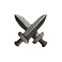

# Parietal (Motor Focus)

### Tier 1&#x20;

<mark style="color:purple;">**Mobility**</mark> - **3** Points possible&#x20;

* Each point adds <mark style="color:red;">**\[+1 Motor]**</mark> stat to any **Node** or **Wave** class card in your deck.

### Tier 2&#x20;

Requires a minimum of **3** Points used so far to unlock this Tier.

<mark style="color:purple;">**Link**</mark> - **1** Point possible&#x20;

* **Connect** spells get <mark style="color:red;">**\[+10]**</mark> increase in their target focus.

<mark style="color:purple;">**Muse**</mark> - **1** Point possible&#x20;

* All <mark style="color:red;">**\[Motor]**</mark> focused spells deal <mark style="color:red;">**\[+5 Damage]**</mark>

<mark style="color:purple;">**Secret**</mark> - **5** Points possible&#x20;

* Each point adds <mark style="color:blue;">**\[+2 Persistent IQ]**</mark> every time a Node or Wave is **\[Hidden]**.

### Tier 3&#x20;

Requires a minimum of **5** Points used so far to unlock this Tier.

<mark style="color:purple;">**Knot**</mark> - **5** Points possible - Can only be accessed by adding **1** point into [<mark style="color:purple;">**Muse**</mark>](parietal-motor-focus.md#tier-2)<mark style="color:purple;">**.**</mark>&#x20;

* Each point adds<mark style="color:red;">**\[+2 Motor]**</mark> stat to any **Node** class card in your deck.

<mark style="color:purple;">**Foam Up**</mark> - **5** Points possible - Can only be accessed by adding **1** point into [<mark style="color:purple;">**Muse**</mark>](parietal-motor-focus.md#tier-2)<mark style="color:purple;">**.**</mark>  &#x20;

* Each point adds<mark style="color:red;">**\[+2 Motor]**</mark> stat to any **Wave** class card in your deck.

### Tier 4

Requires a minimum of **10** Points used so far to unlock this Tier.

<mark style="color:purple;">**The More**</mark>- **5** Points possible&#x20;

* Multi target spells get <mark style="color:red;">**\[+2 Damage]**</mark> for each point.

### Tier 5

Requires a minimum of **15** Points used so far to unlock this Tier.

<mark style="color:purple;">**Tangle**</mark> - **5** Points possible - Can only be accessed by adding **5** points into [<mark style="color:purple;">**Knot**</mark>](parietal-motor-focus.md#tier-3)<mark style="color:purple;">**.**</mark>&#x20;

* Each point adds<mark style="color:red;">**\[+2 Motor]**</mark> stat to any **Node** class card in your deck.

<mark style="color:purple;">**Froth**</mark> - **5** Points possible - Can only be accessed by adding **5** points into [<mark style="color:purple;">**Foam Up**</mark>](parietal-motor-focus.md#tier-3)<mark style="color:purple;">**.**</mark>  &#x20;

* Each point adds<mark style="color:red;">**\[+2 Motor]**</mark> stat to any **Wave** class card in your deck.
