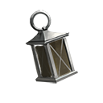

# Thalamite (Temporal Focus)

### Tier 1&#x20;

<mark style="color:purple;">**Rejuvenation**</mark> - **3** Points possible&#x20;

* Each point adds <mark style="color:green;">**\[+1 Healing]**</mark> stat to any **Sensor** or **Melder** class card in your deck.

<mark style="color:purple;">**Shock**</mark> - **3** Points possible&#x20;

* Each point adds <mark style="color:blue;">**\[+1 Temporal]**</mark> stat to any **Sensor** or **Melder** class card in your deck.

### Tier 2&#x20;

Requires a minimum of **3** Points used so far to unlock this Tier.

<mark style="color:purple;">**Chainlink**</mark> - **5** Points possible&#x20;

* Each point adds <mark style="color:green;">**\[+2 Healing]**</mark> to any **Sensor** or **Melder** class card on your Nucleus every 2 turns.

<mark style="color:purple;">**Timed Rage**</mark>** ** - **3** Points possible&#x20;

* Each point subtracts <mark style="color:purple;">**\[-0.033 SRT]**</mark> from any **Sensor** or **Melder** class card in your deck.

### Tier 3&#x20;

Requires a minimum of **5** Points used so far to unlock this Tier.

<mark style="color:purple;">**Mentality**</mark> - **5** Points possible&#x20;

* Each point adds <mark style="color:blue;">**\[+2 IQ]**</mark> to any **Sensor** or **Melder** class card in your deck.

### Tier 4

Requires a minimum of **10** Points used so far to unlock this Tier.

<mark style="color:purple;">**Stir**</mark> - **5** Points possible&#x20;

* Each point adds<mark style="color:blue;">**\[+2 Temporal]**</mark> <mark style="color:blue;"></mark><mark style="color:blue;"></mark> stat to any **Sensor** class card in your deck.

<mark style="color:purple;">**Forge**</mark> - **5** Points possible&#x20;

* Each point adds<mark style="color:blue;">**\[+2 Temporal]**</mark> <mark style="color:blue;"></mark><mark style="color:blue;"></mark> stat to any **Melder** class card in your deck.

### Tier 5

Requires a minimum of **15** Points used so far to unlock this Tier.

<mark style="color:purple;">**Awaken**</mark> - **5** Points possible - Can only be accessed by adding **5** points into [<mark style="color:purple;">**Stir.**</mark>](thalamite-temporal-focus.md#tier-4)&#x20;

* Each point adds <mark style="color:blue;">**\[+2 IQ]**</mark> to any **Sensor** class card in your deck.

<mark style="color:purple;">**Fuse**</mark>** ** - **5** Points possible - Can only be accessed by adding **5** points into <mark style="color:purple;">****</mark> [<mark style="color:purple;">**Forge**</mark>](thalamite-temporal-focus.md#tier-4)<mark style="color:purple;">**.**</mark> <mark style="color:purple;">****</mark>&#x20;

* Each point adds <mark style="color:blue;">**\[+2 IQ]**</mark> to any **Melder** class card in your deck.
