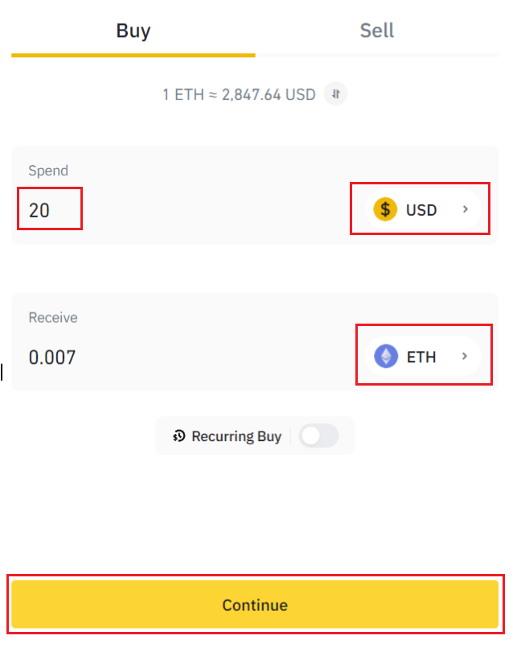
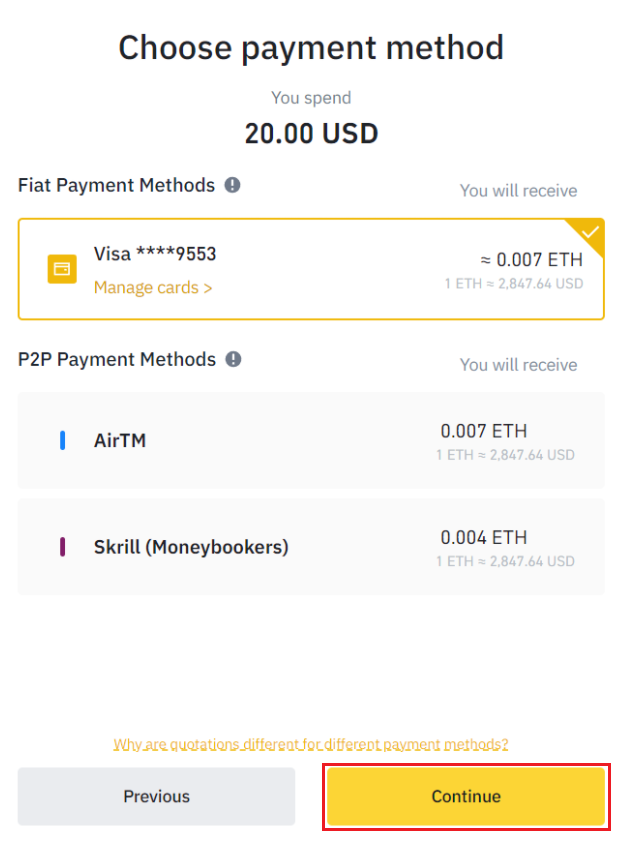

# Step 1 - Ethereum

**Be sure you have Ethereum in your** [**Metamask**](https://metamask.io/) **wallet. If you already have Ethereum, please jump to the next guide:** [**How to transfer your assets to the Aurora network.**](step-2-near-wallet.md)****

**If you don’t have Ethereum in your wallet, please follow the guidelines from the beginning.**

## Get Ethereum

**You need to help yourself with some Ethereum. In our example, we are going to use Binance. Please create an account if you don’t already have one at** [**www.binance.com**](http://www.binance.com)**.**

****\
**After creating the account, access the following link and press on Buy ETH here:** [**https://www.binance.com/en/buy-ethereum**](https://www.binance.com/en/buy-ethereum)****

****

**\*If you don’t know how to create an account, please refer to the following page:** [**https://academy.binance.com/en/articles/binance-beginner-s-guide**](https://academy.binance.com/en/articles/binance-beginner-s-guide)****\
****

**\*Guideline for mobile app on how to buy crypto from Binance after you created an account:** [**https://www.binance.com/en/support/faq/7a795b5916db4a3ea57c1a1208e19581**](https://www.binance.com/en/support/faq/7a795b5916db4a3ea57c1a1208e19581)****

.png>)

****

**Select the preferred currency in the “Spend” bar ex.: USD, GBP, EUR, AED, etc., and “ETH” token in the “Receive” bar (in our example, we used 20 USD in exchange for 0.007 ETH) and press Continue.**

****

**Make sure you assign your credit card to your Binance account on the following screen and hit Continue.**

**Confirmation should appear on the screen with the following message “Purchase complete.” Press “Go To Wallet” and follow the next step.**

## Transfer Ethereum from Binance to Metamask

**To do that, please follow the next procedure:**

**The balance of your currency will be displayed first. Press on the “Withdraw” option.**

**The following step is to log in to your Metamask wallet.**&#x20;

**If you don't have a Metamask wallet, please create one and follow the instructions below:**

****[**https://tinyurl.com/3c6m5ruw**](https://tinyurl.com/3c6m5ruw) **** \
****\
**After creating your wallet continue with this guide.**

****

**Click on Metamask wallet and select Ethereum Mainnet. The next step is to click on your account (in my case, "Account 1") to copy your Metamask Ethereum address.**

**Select ETH coin, paste your Metamask wallet address into the Binance "Withdraw to" address bar.**

**"Withdraw to" address bar select Network "ETH Ethereum (ERC20)".**

**Choose the amount you want to transfer.**

**Double-check the Ethereum address you've pasted it's correct, and click Withdraw.**

**Read, understand then Check the Risk Warning and hit Confirm.**

**Press continue on the Withdrawal screen.**

**Enter your verification codes from your phone and e-mail after pressing "Get code" on both options.**

**A withdrawal completion prompt screen will pop up confirming your transaction.**

**Usually, an "Awaiting approval" is made, and you will have to wait until it's completed (the approximation is only for suggestion depending on how much traffic on the network will be).**

