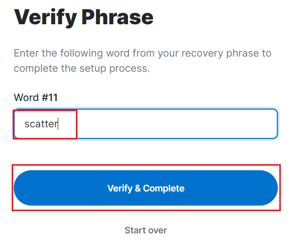

# Step 2 - NEAR Wallet

**The next step is to acquire at least 0.1 NEAR in our NEAR wallet which we will create in a few seconds, please follow the instructions below:**

**Create an account on** [**https://wallet.near.org/**](https://wallet.near.org/)****

.png>)

**Press on "Get started"**

.png>)

**Select your security method, in our case please choose the secured passphrase option.**

**Take a blank page and write down your seed phrase (recommended) or press the copy button and paste it into a document.**

**The next step is to verify one of the seed phrase words, in our case is word #11, which stands for "scatter" as given in the seed phrase.**

**A window will pop with your NEAR wallet address. The next step is to put your hands on some NEAR tokens (at least 0.1 NEAR).**&#x20;

**Press the "Copy" button to copy your Near wallet address and paste the seed phrase in the same document you have noted.**

**You can get Near from Moonpay or Binance. As we already created an account on Binance, we can use that exchange to buy NEAR, the process is the same as buying ETH, but now we will select another token, NEAR token.**

